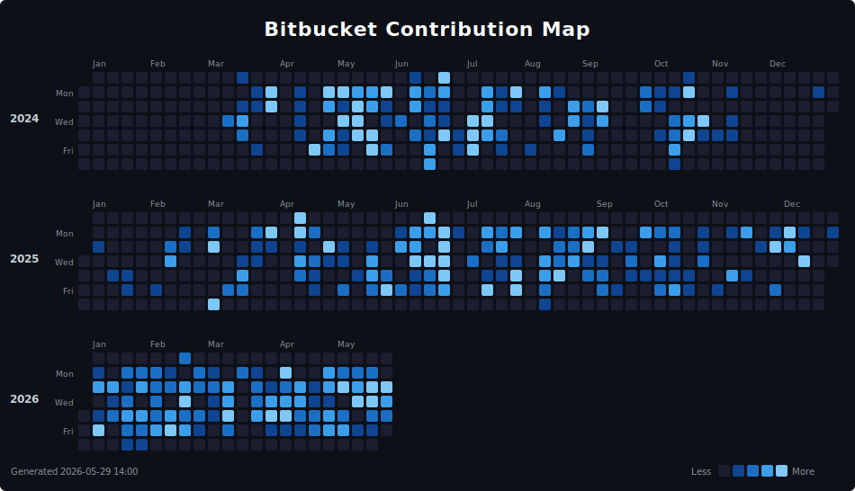

# Andres Solenzal

**Senior Full-Stack Engineer**

*Node.js · React · Next.js · AWS · Identity Systems*

---

Senior Full-Stack Engineer with over a decade of experience designing, building, and scaling distributed systems, authentication platforms, and cloud-native applications. Trusted by companies such as **Articulate**, **Telus**, and **Zignal Labs** to deliver robust identity infrastructures, automation pipelines, and full-stack solutions.

Strong advocate of clean architecture, developer experience, and high-performing engineering culture.

---

## AI-Augmented Engineering

I integrate AI agents into my daily engineering workflows — not as a novelty, but as a force multiplier for architecture, correctness, and delivery speed.

- Integrate AI into daily development workflows to accelerate implementation, debugging, and system understanding while maintaining full control over architecture and correctness
- Use **Claude Code** to implement and refactor services, debug AWS infrastructure issues, and analyze large codebases
- Apply agent-based workflows to evaluate the impact of changes before deployment, reducing regressions in interconnected systems
- Generate and review tests using AI to improve coverage and validate behavior in complex microservice environments

---

## Tech Stack

**Backend & Runtime**

**Frontend**

**Databases**

**Cloud & Infrastructure**

**Identity & Auth**

**Testing & CI/CD**

**AI Tooling**

---

## Career Highlights

| Company | Role | Impact |
|---------|------|--------|
| **All Point Retail** | Senior Full-Stack Engineer | Reduced Next.js page load from 60s → 4s. Cut Data API queries from 4,000 → ~10 per operation. Built multi-tenant email service on AWS SES/SNS with real-time delivery tracking. Contributed to a distributed microservice architecture synchronizing data across Teamwork, QuickBooks, and Route Manager. Implemented database indexing that drove significant latency improvements across the platform. |
| **Articulate** (via X-Team) | Senior Full-Stack Engineer | Built custom SCIM server solving Okta's multi-tenant provisioning limitations by encoding tenant identifiers at each entry point. Led the in-house IdP replacing Okta — implementing OAuth 2.0, email/password flows, session management, token lifecycle, and revocation logic. Developed a SCIM RFC-compliant validation service automating payload validation across multiple tenants. Enhanced auth state management across microservices for consistent login under complex OAuth scenarios. Mentored two engineers during a leadership transition. |
| **Telus** (via X-Team) | Senior Full-Stack Engineer | Designed and shipped the Telus Rewards Allocation Utility serving 1M+ users. Integrated with external loyalty platforms via XML APIs for accurate, real-time points synchronization. Implemented multi-source data sync and error handling workflows to maintain consistency between spending and reward eligibility data. Contributed to scalability and monitoring initiatives for high-load reward events. |
| **Zignal Labs** (via Admios) | Senior Full-Stack Engineer | Designed a custom DSL using ANTLR to translate human-readable query syntax into Elasticsearch JSON queries. Improved parser performance by walking AST subtrees in parallel and caching node results. Built a comprehensive testing framework validating query equivalence against millions of existing profiles. Drove Elasticsearch query optimization and system reliability improvements. Won 2 company-wide hackathons. |
---

## Contribution Activity

> I work remotely, and my engineering output is spread across multiple platforms: this GitHub account, a Bitbucket account used for professional work (where the activity graph below originates), and a secondary GitHub account at [@asolenzal-art](https://github.com/asolenzal-art). The graph is updated daily and it was generated using [this](https://github.com/asolenzal/bb-contributions-graph) small tool.

---

## About

- **Background:** B.S. in Information Technologies Engineering · University of Cienfuegos, Cuba · 2009
- **Languages:** Spanish (Native) · English (Full Professional Proficiency)
- **Location:** Panama City · Remote

---

